# SAE D03

<link rel="stylesheet" type="text/css" href="style.css">

</br></br></br>

## Situation professionnelle

Vous êtes technicien dans une équipe en charge des réseaux d'une grande entreprise. L'entreprise gère une AS BGP privée pour chacune de ses filiales et vous êtes responsable d'une de ces AS.

</br></br></br>

## Table des matières

1. Mise en place de la SAE
2. Mise en place des configurations
3. Preuves de bon fonctionnement
4. Utilisation des différents protocoles d'administrations

<div style="page-break-after: always; visibility: hidden">\pagebreak</div>

## Mise en place de la SAE

1. Initialisation
2. Mise à jour
3. Limitation et solution
4. Mise en place des machines virtuelles

### Initialisation

Comme tout routeur Cisco l'initialisation débute avec la connexion de notre ordinateur au routeur par port série, pour ce faire, nous avons utilisé le logiciel `minicom`, on branche le câble série, on paramètre minicom avec le bon port série (dans notre cas `/dev/ttyS0` qui est trouvable avec la commande `sudo dmesg | grep tty`) et le bon débit (dans notre cas `9600 8N1`). Une fois connecté, on arrive à cela :

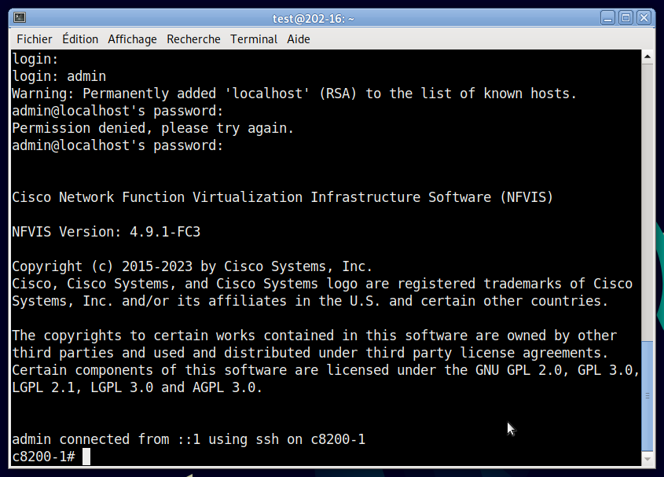

Étant connecté sur l'interface série, on peut mettre une IP, et un mot de passe au C8200. Cette IP mise, on peut maintenant réaliser les configurations sur l'interface WEB, de même en SSH.

### Mise à jour

Selon la documentation Cisco, il existe des restrictions :

```cisco
Restrictions for Cisco NFVIS ISO File Upgrade
Cisco NFVIS supports .iso upgrade only from version N to versions N+1 and N+2. NFVIS does not support .iso upgrade from version N to version N+3 and above.
```

On sait donc qu'avec notre version de base en 4.5.1 on pourra aller qu'à N+2, selon le tableau de la même documentation, on doit passer par la 4.6.1 puis la 4.7.1 et pour finir la 4.9.1, pour réaliser ces mises à jour, on va dans l'onglet `Operation` ensuite dans `Upgrade`. Ici, on ajoute l'image de mise à jour, ensuite, une fois envoyée, on peut effectuer les mises à jour unes par unes. Elles durent en moyenne entre 20 et 30 minutes.


### Limitation et solution

Un problème qui arrive assez rapidement avec le C8200 d'origine est son espace de stockage, il est assez limité, tout particulièrement quand on fait tourner plusieurs machines virtuelles.

Pour régler ce problème, on peut supprimer des images gardées en cache dans la mémoire du C8200. Pour ce faire, il existe deux commandes, la première est la suivante, qui permet de lister tous les fichiers du C8200, pour voir lesquels on peut supprimer.

```bash
show system file-list
```

Ce qui donne :

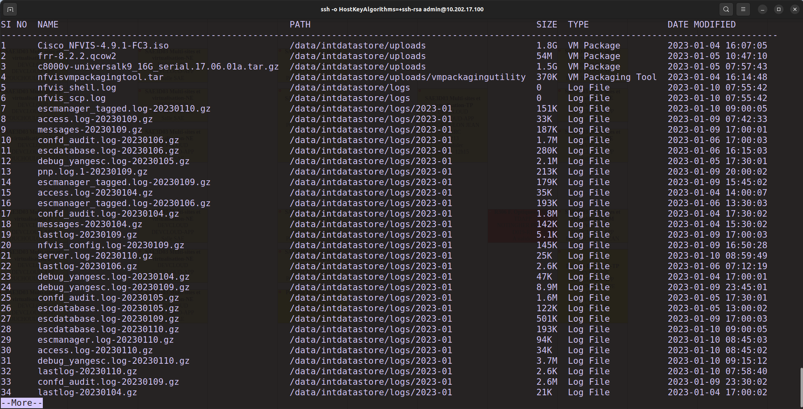

Une fois les fichiers que l'on souhaite sélectionner, on peut les supprimer avec la commande suivante :

```bash
system file-delete file name [chemien complet]
#exemple :
system file-delete file name /data/intdatastore/uploads/centosvm.ova
```

</br>

### Mise en place des machines virtuelles

Pour mettre en place les machines virtuelles, il faut se rendre dans Configuration > Virtual Machine > Images > Image Repository. Une fois sur cette interface, on peut importer nos machines virtuelles.

Une fois les images, ova, tar.gz,... on peut se rendre dans l'onglet Configuration > Deploy. Sur cette interface, on va déployer nos deux routeurs et notre machine virtuelle, une fois déployé, il faut créer les réseaux pour les connecter, pour cela, on va dans Configuration > Virtal Machine > Networking > Bridge où on va créer des bridges que nous n'allons pas connecter à une interface. Dans notre cas, il s'appelle BR1 :

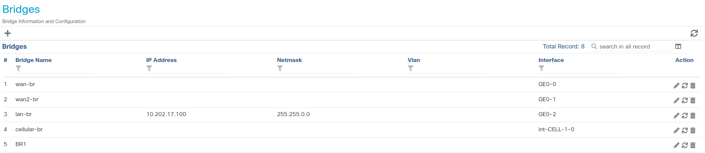

Le bridge créé, on peut se rendre dans Configuration > Virtal Machine > Networking > Networks pour créer nos deux réseaux, qui seront réalisés au bridge précédemment créé, afin de pouvoir connecter nos machines virtuelles. Dans notre cas NET-1 et NET-2 :

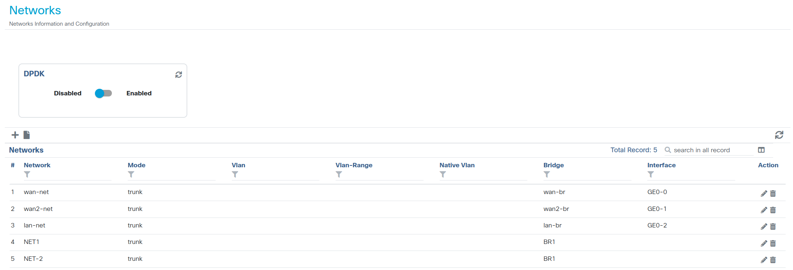

Les machines en places, reliées et allumées, nous sommes prêts à les configurer.

<div style="page-break-after: always; visibility: hidden">\pagebreak</div>

## Mise en place des configurations des machine virtuelles

Une fois les machines en places, on a trois méthodes pour les configurer, en SSH directement si elles ont une IP, en console depuis l'interface WEB ou en console depuis l'interface CLI (en SSH) du C8200.

Pour le Cisco, je me suis connecté en premier lieu au C8200 en SSH avec la commande `ssh -o HostKeyAlgorithms=+ssh-rsa admin@10.202.17.100` puis une fois dessus, j'ai pu lister les machines virtuelles qui tournaient dessus avec la commande `show system deployments`.

```bash
mathieu@mathieu-pc ~ ssh -o HostKeyAlgorithms=+ssh-rsa admin@10.202.17.100
admin@10.202.17.100 s password: 

Cisco Network Function Virtualization Infrastructure Software (NFVIS)

NFVIS Version: 4.9.1-FC3

Copyright (c) 2015-2023 by Cisco Systems, Inc.
Cisco, Cisco Systems, and Cisco Systems logo are registered trademarks of Cisco
Systems, Inc. and/or its affiliates in the U.S. and certain other countries.

The copyrights to certain works contained in this software are owned by other
third parties and used and distributed under third party license agreements.
Certain components of this software are licensed under the GNU GPL 2.0, GPL 3.0,
LGPL 2.1, LGPL 3.0 and AGPL 3.0.

admin connected from 10.202.0.170 using ssh on c8200-1
c8200-1# show system deployments                                            
NAME      ID  STATE    TYPE  
-----------------------------
c8000v1   1   running  vm    
ROUTER53  3   running  vm    
DEBIAN    5   running  vm 
```

Une fois la machine repérée, j'ai pu m'y connecter avec la commande `vmConsole [nom de la vm]`.

```bash
c8200-1# vmConsole c8000v1
Connected to domain c8000v1
Escape character is ^]

c8000v-math>
```

Une fois dans le Cisco c8000v, j'ai configuré les différentes IP de mes réseaux, mon BGP, mes voisins etc... Voici un extrait de ma configuration du Cisco c8000v dans lequel on peut voir les éléments principaux de la configuration finale.

```conf-cisco
interface Loopback1
 description loopback
 ip address 1.1.1.1 255.255.255.255
 shutdown
!
interface Loopback2
 description La loopback deux retour
 ip address 5.5.5.5 255.255.255.255
 shutdown
!
interface GigabitEthernet1
 vrf forwarding Mgmt-intf
 ip address 10.20.0.2 255.255.255.0
 negotiation auto
 no mop enabled
 no mop sysid
!
interface GigabitEthernet2
 ip address 10.202.17.200 255.255.0.0
 negotiation auto
 no mop enabled
 no mop sysid
!
interface GigabitEthernet4
 ip address 192.168.2.1 255.255.255.0
 negotiation auto
 no mop enabled
 no mop sysid
!
router bgp 65200
 bgp log-neighbor-changes
 neighbor 10.202.18.101 remote-as 65100
 neighbor 192.168.2.2 remote-as 65200
 !
 address-family ipv4
  network 10.202.0.0
  network 192.168.2.0
  redistribute connected
  redistribute static
  neighbor 10.202.18.101 activate
  neighbor 192.168.2.2 activate
 exit-address-family
!
ip forward-protocol nd
ip http server
ip http authentication local
ip http secure-server
!
ip route 0.0.0.0 0.0.0.0 10.202.255.254
ip route vrf Mgmt-intf 0.0.0.0 0.0.0.0 10.20.0.1
ip ssh rsa keypair-name ssh-key
ip ssh version 2
!
snmp-server community public RO
!
netconf-yang
restconf
end
```

Configuration complète dans confc8000v.txt

Pour le FRR, j'ai réalisé la configuration depuis la console WEB, pour cela, je me suis rendu dans Configuration > Virtual Machine > Manage et je clique sur `Terminal`. Une fois sur la console, je peux, comme pour le Cisco, configurer mes différentes interfaces, réseaux, configurations BGP, etc... Voici ce que donne ma configuration finale :

```bash
Current configuration:
!
frr version 8.2.2
frr defaults traditional
hostname frr
service integrated-vtysh-config
!
interface eth0
    ip address 192.168.2.2/24
exit
!
interface eth1
    ip address 192.168.20.1/24
exit
!
interface lo
    ip address 2.2.2.2/32
    shutdown
exit
!
router bgp 65200
    neighbor 192.168.2.1 remote-as 65200
    !
    address-family ipv4 unicast
        network 192.168.2.0/24
        network 192.168.20.0/24
    exit-address-family
exit
!
end
```

Configuration complète dans confFRR.png

En ce qui concerne la machine virtuelle Debian, rien de très compliqué, il suffit de configurer l'interface réseau.

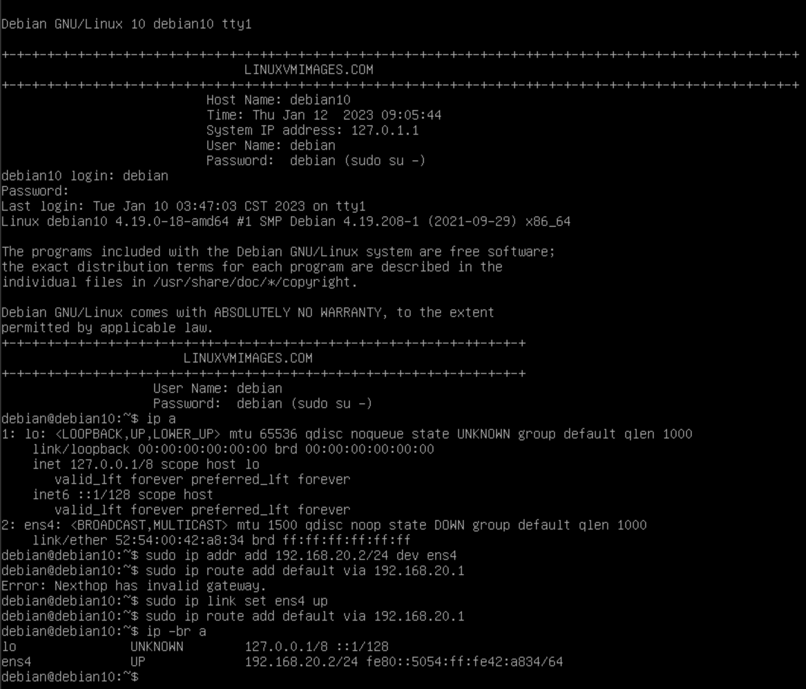

<div style="page-break-after: always; visibility: hidden">\pagebreak</div>

## Bon fonctionnement

A ce stade, notre réseau ressemble à cela (avec l'environnement de TP Cisco pris en compte) :

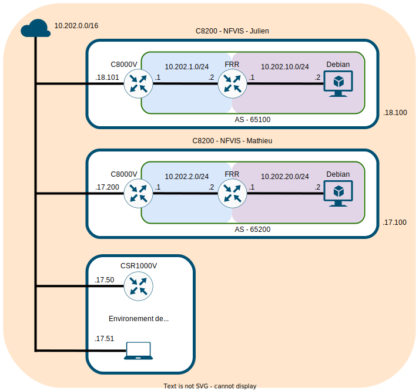

Niveau NFVIS :

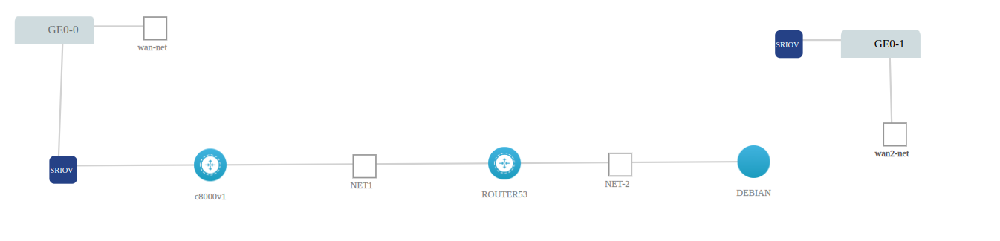

Du côté des routeurs les échanges des routes BGP, on était effectué.

Pour le Cisco :

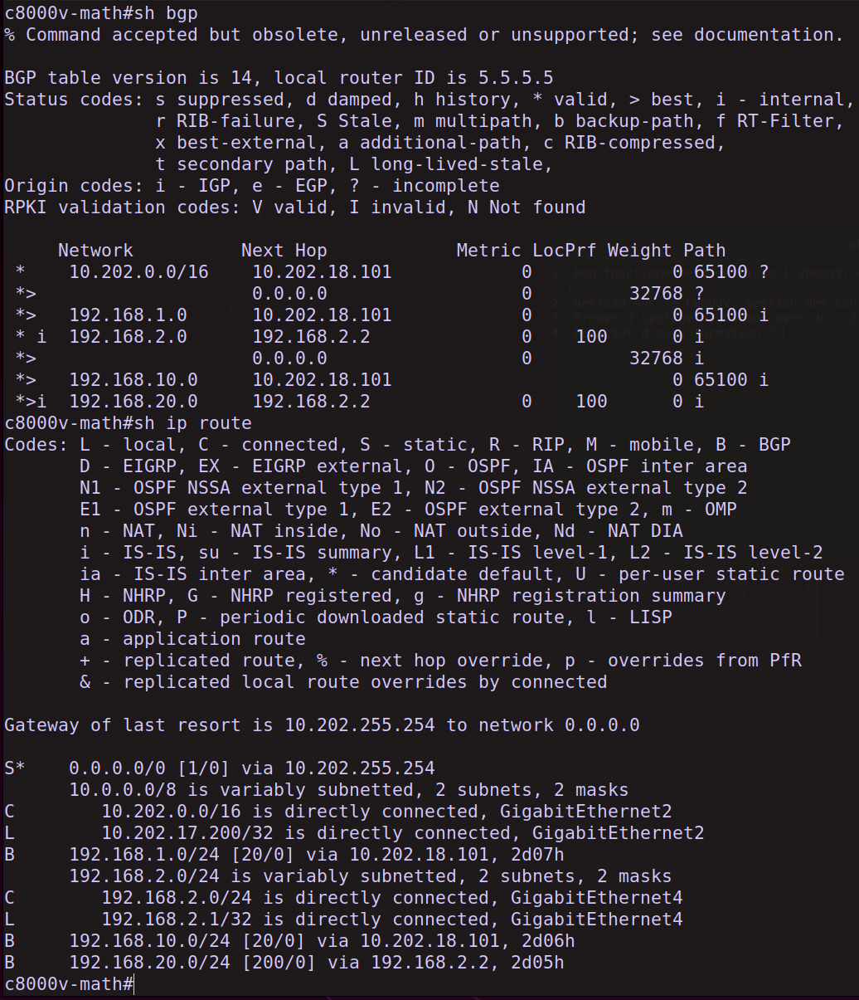

<div style="page-break-after: always; visibility: hidden">\pagebreak</div>

Pour le FRR :

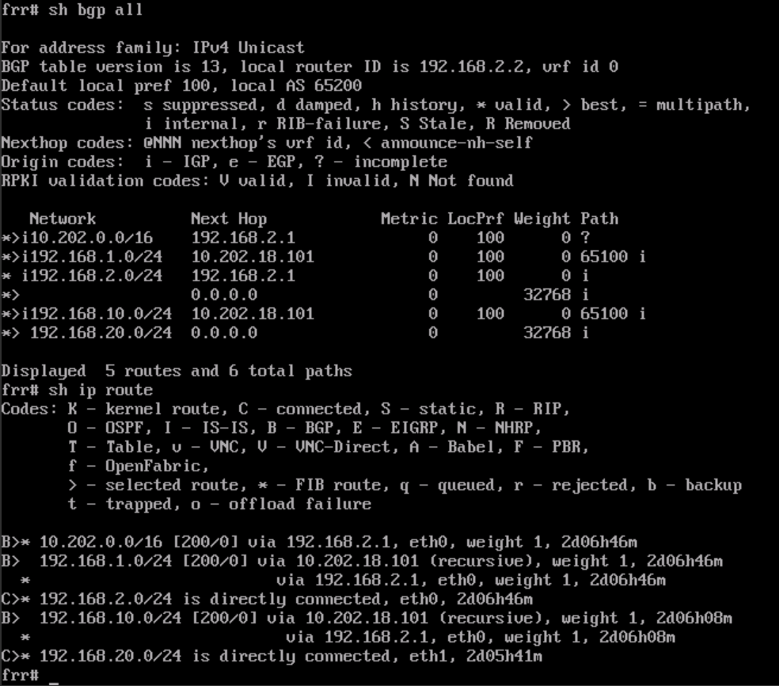

Avec toutes les routes propagées nos machines Debian peuvent communiquer entre elle :

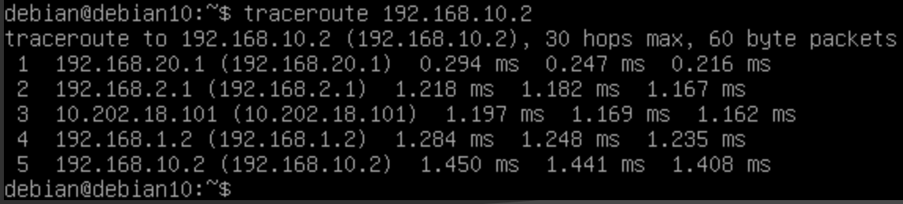

<div style="page-break-after: always; visibility: hidden">\pagebreak</div>

De plus, en preuve de fonctionnement, pour en se connectant au routeur maître, j'ai pu récupérer environ 500 000 routes :

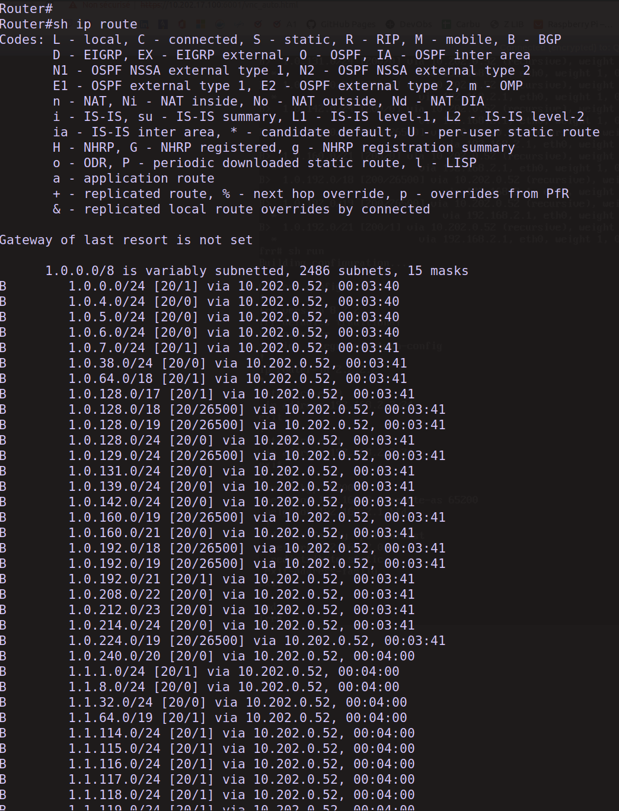

<div style="page-break-after: always; visibility: hidden">\pagebreak</div>

## Utilisation des différents protocoles d'administration sur le C800V

1. SNMP
2. NETCONF
3. RESTCONF

### SNMP

J'ai mis en place le SNMP sur mon routeur Cisco. Il est en public et en lecture seule, ce qui me permet de récupérer toutes les informations que je veux.

Du côté routeur, j'active le serveur avec la commande `snmp-server community public RO`.

Sur mon client, j'ai installé les paquets `snmp` et `snmp-mibs-downloader` et j'ai effectué la commande `sudo wget http://pastebin.com/raw.php?i\=p3QyuXzZ -O /usr/share/snmp/mibs/ietf/SNMPv2-PDU` pour enlever les possibles erreurs.

Après cela, j'ai donc pu communiquer avec mon routeur en SNMP :

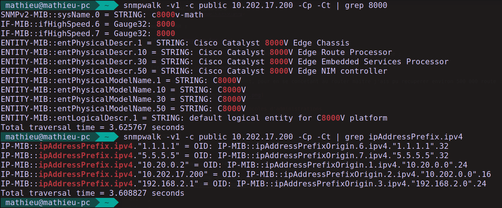

### NETCONF

Netconf utilise le modèle de données YANG pour communiquer avec les appareils réseaux. Yang et un langage de modélisation de données.

#### Côté routeur

Activation avec la commande `netconf-yang` dans le mode configuration terminal du routeur.

Pour obtenir le nom du `datasore dnetconf-yang` il existe la commande `show netconf-yang datastores`.

<div style="page-break-after: always; visibility: hidden">\pagebreak</div>

#### Version CLI

Voici un exemple d'utilisation CLI de netconf.

Connexion au routeur :

```bash
ssh admin1@10.202.17.200 -p 830 -s netconf
```

Réaliser le handshake :

```bash
<?xml version="1.0" encoding="UTF-8"?><hello xmlns="urn:ietf:params:xml:ns:netconf:base:1.0"><capabilities><capability>urn:ietf:params:netconf:base:1.0</capability></capabilities></hello>]]>]]>
```

Pour récupérer toutes les interfaces :

```bash
<rpc message-id="103" xmlns="urn:ietf:params:xml:ns:netconf:base:1.0"> <get> <filter> <interfaces xmlns="urn:ietf:params:xml:ns:yang:ietf-interfaces"/> </filter> </get></rpc>]]>]]>
```

Et finalement pour fermer la session :

```bash
<rpc message-id="9999999" xmlns="urn:ietf:params:xml:ns:netconf:base:1.0">
<close-session/></rpc>]]>]]>
```

#### Côté client

Côté du client (administrateur), on peut utiliser du python pour réaliser notre administration. (Le faire manuellement étant bien trop fastidieux)

<div style="page-break-after: always; visibility: hidden">\pagebreak</div>

##### Initialisation du code

Code pour initier la connexion :

```python
from ncclient import manager
import xml.dom.minidom

m = manager.connect (
 host="10.202.17.200",
 port=830,
 username="admin1",
 password="Root123#",
 hostkey_verify=False
 )
```

##### Récupérer la running-config

```python
netconf_filter = """
<filter xmlns="urn:ietf:params:xml:ns:netconf:base:1.0">
 <native xmlns="http://cisco.com/ns/yang/Cisco-IOS-XE-native"/>
</filter>
"""

netconf_reply = m.get_config(source="running", filter=netconf_filter) #connexion et récuperation da la config du datastores

print (xml.dom.minidom.parseString(netconf_reply.xml).toprettyxml())
```

[Retour du code dans le fichier conf-xml-c800v.xml](./conf-xml-c800v.xml)


<div style="page-break-after: always; visibility: hidden">\pagebreak</div>

##### Changer le hostname

```python
#configuration du nouvaux nom
netconf_hostname = """
<config xmlns="urn:ietf:params:xml:ns:netconf:base:1.0">
    <native xmlns="http://cisco.com/ns/yang/Cisco-IOS-XE-native">
        <hostname>c8000v-math</hostname>
    </native>
</config>
"""

netconf_reply = m.edit_config(target="running", config=netconf_hostname) #edtition de la configuration

print (xml.dom.minidom.parseString(netconf_reply.xml).toprettyxml()) #affige du retour
```

Retour :

```xml
<?xml version="1.0" ?>
<rpc-reply xmlns="urn:ietf:params:xml:ns:netconf:base:1.0" xmlns:nc="urn:ietf:params:xml:ns:netconf:base:1.0" message-id="urn:uuid:1847ee8b-e768-4be2-a516-a3a0bcfeff24">
    <ok/>
</rpc-reply>
```

<div style="page-break-after: always; visibility: hidden">\pagebreak</div>

##### Ajouter une loopback

```python
#ici est present la configuration de la lo que je veux rajouter
netconf_loopback = """
<config xmlns="urn:ietf:params:xml:ns:netconf:base:1.0">
    <native xmlns="http://cisco.com/ns/yang/Cisco-IOS-XE-native">
        <interface>
            <Loopback>
                <name>1</name>
                <description>loopback</description>
                <ip>
                    <address>
                        <primary>
                            <address>1.1.1.1</address>
                            <mask>255.255.255.255</mask>
                        </primary>
                    </address>
                </ip>
            </Loopback>
        </interface>
    </native>
</config>
"""

netconf_reply = m.edit_config(target="running", config=netconf_loopback)

print (xml.dom.minidom.parseString(netconf_reply.xml).toprettyxml())
```

On obtient le même retour que précédemment.

Coté routeur la configuration a bien été prise :


<div style="page-break-after: always; visibility: hidden">\pagebreak</div>

### RESTCONF

Netconf RESTCONF fournit un sous-ensemble simplifié de fonctionnalités NETCONF.

#### Côté routeur

Activation avec la commande `restconf` dans le mode configuration terminal du routeur et les commandes suivantes pour activer le serveur HTTPS et le mode d'authentification : `ip http secure-server`, ` ip http authentication local`.

Pour vérifier que tout est en état de fonctionnement, il existe la commande `show platform software yang-management process`.

#### Version graphique

On peut utiliser les différentes méthodes en version graphique avec des utilisés comme postman.
Pour cela, on doit désactiver les certificats SSL, choisir la méthode à utiliser, donner la requête souhaitée et quelques autres étapes ce qui nous permet au final d'obtenir, une fois envoyée, un résultat.


#### Côté  client

Côté du client (administrateur), on va utiliser du python pour réaliser notre administration.

##### Utilisation GET

Ici, on va utiliser la méthode GET, pour obtenir la configuration de nos différentes interfaces réseaux.

```python

import json
import requests
requests.packages.urllib3.disable_warnings()

############### GET ###############

api_url="https://10.202.17.200/restconf/data/ietf-interfaces:interfaces" #requête que l'on souhaite efectuer

headers={"Accept":"application/yang-data+json","Content-type":"application/yang-data+json"} # entête de la requête

basicauth=("admin1", "Root123#") #credentier de notre routeur

resp = requests.get(api_url, auth=basicauth, headers=headers, verify=False) #requête "complete

print(resp) # affichage du code reponse

response_json = resp.json()

print(json.dumps(response_json, indent=4)) # affichage de la reponse sous forme de json
```

Retour de la requête précédente :

```json
<Response [200]>
{
    "ietf-interfaces:interfaces": {
        "interface": [
            {
                "name": "GigabitEthernet1",
                "type": "iana-if-type:ethernetCsmacd",
                "enabled": true,
                "ietf-ip:ipv4": {
                    "address": [
                        {
                            "ip": "10.20.0.2",
                            "netmask": "255.255.255.0"
                        }
                    ]
                },
                "ietf-ip:ipv6": {}
            },
            {
                "name": "GigabitEthernet2",
                "type": "iana-if-type:ethernetCsmacd",
                "enabled": true,
                "ietf-ip:ipv4": {
                    "address": [
                        {
                            "ip": "10.202.17.200",
                            "netmask": "255.255.0.0"
                        }
                    ]
                },
                "ietf-ip:ipv6": {}
            },
            {
                "name": "GigabitEthernet4",
                "type": "iana-if-type:ethernetCsmacd",
                "enabled": true,
                "ietf-ip:ipv4": {
                    "address": [
                        {
                            "ip": "192.168.2.1",
                            "netmask": "255.255.255.0"
                        }
                    ]
                },
                "ietf-ip:ipv6": {}
            },
            {
                "name": "Loopback1",
                "description": "loopback",
                "type": "iana-if-type:softwareLoopback",
                "enabled": true,
                "ietf-ip:ipv4": {
                    "address": [
                        {
                            "ip": "1.1.1.1",
                            "netmask": "255.255.255.255"
                        }
                    ]
                },
                "ietf-ip:ipv6": {}
            }
        ]
    }
}
```

##### Ajout d'une loopback avec la méthode post

Ici, on va utiliser la méthode POST, pour créer une interface réseau.

```python
import json
import requests
requests.packages.urllib3.disable_warnings()

headers={"Accept":"application/yang-data+json","Content-type":"application/yang-data+json"} #requête que l'on souhaite efectuer

basicauth=("admin1", "Root123#") #credentier de notre routeur

api_url2 = "https://10.202.17.200/restconf/data/ietf-interfaces:interfaces/interface=Loopback2" # entête de la requête

#crop de notre requête :
YangConfig = {
"ietf-interfaces:interface": {
    "name": "Loopback2",
    "description": "La loopback deux retour",
    "type": "iana-if-type:softwareLoopback",
    "enabled": True,
    "ietf-ip:ipv4": {
        "address": [
            {
                "ip": "5.5.5.5",
              "netmask":"255.255.255.255"
            }
        ]
    },
    "ietf-ip:ipv6": {}
    }
}

resp = requests.put(api_url2,data=json.dumps(YangConfig),auth=basicauth,headers=headers,verify=False)

if(resp.status_code >= 200 and resp.status_code <= 299):
    print("STATUS OK: {}".format(resp.status_code)) #affichage du status
else:
    print('Error. Code d\'état : {} \n Message d\'erreur : {} '.format(resp.status_code, resp.json())) #affichage du status
```

Retour :

```http status
STATUS OK: 201
```

Côté routeur, la configuration a bien été prise :


<div style="page-break-after: always; visibility: hidden">\pagebreak</div>

## (Bonus) Les TP Cisco

<link rel="stylesheet" type="text/css" href="style.css">

### TP1

#### 7.0.3-lab---install-the-csr1000v-vm_fr-FR.pdf

Ici tout va bien, c'est normal, il est en anglais.

### TP2

#### 7.6.3-lab---automated-testing-using-pyats-and-genie_fr-FR.pdf

Ici de même, tout va bien le seul problème étant le code qui est mal interprété par le PDF ce qui cause la création d'espaces lors du copier-coller.

### TP3

#### 8.3.5-lab---explore-yang-models_fr-FR.pdf

Ici tout va bien.

### TP4

#### 8.3.6-lab---use-netconf-to-access-an-ios-xe-device_fr-FR.pdf

Problème à la page 4, il manque une ">".


### TP5

#### 8.3.7-lab---use-restconf-to-access-an-ios-xe-device_fr-FR.pdf

Premier problème page 7, des simples quotes a la place des doubles sont utilisés.


De même page 8.


De mêmes page 12.


Ici, page 12, headers a été traduit.


Ici, encore page 12, il manque des "\\".


Correction :

```python
if(resp.status_code >= 200 and resp.status_code <= 299):
    print("STATUS OK: {}".format(resp.status_code))
else:
    print('Error. Code d\'état : {} \n Message d\'erreur : {} '.format(resp.status_code, resp.json()))
```

<div style="page-break-after: always; visibility: hidden">\pagebreak</div>

## Signature de Mr. ALLEAUME Julien


